# Google Earth Engine - Green Spaces in Athens

This search was conducted using the Google Earth Engine platform, along with the utilization of Landsat 8 and 9 imagery and Random Forest supervised machine learning algorithms.

## Main Subject and Goal
Beyond the national parks, forests and mountains that surround and influence the climate in a city, it has been revealed that urban green spaces, small or large, can bring significant health benefits to city dwellers by influencing the micro-climate of a city as well as the daily life of its citizens.

The underlying mechanism associated with the health benefits of urban green spaces is complex but can largely be attributed to various ecological and social functions of green spaces. Green spaces can contribute to public health by improving air quality, alleviating the urban heat island effect and reducing noise levels. They also enhance physical activity, reduce stress, improve mental health and social cohesion and improve immune system function. Therefore, maintaining urban green spaces and enhancing their health benefits is an important component of urban health management.

The [World Health Organization](https://www.euro.who.int/__data/assets/pdf_file/0005/321971/Urban-green-spaces-and-health-review-evidence.pdf) (WHO) recognizes as key indicators for measuring the impact of urban green spaces on citizens' quality of life a) the availability, extent or percentage of urban green spaces in a city, b) their accessibility , often measured as the proximity (linear distance or walking distance) of urban green spaces to the community. Obviously there are other important indicators such as the biodiversity of green spaces that also play a significant role in urban health.

Due to the wide spatiotemporal coverage and availability of satellite data, remote sensing can play an important role in assessing the condition and characteristics of urban green spaces, which in turn provides an indirect way of calculating the benefits to citizens' health. In this study, availability and accessibility - two proxy indicators of the health benefits generated by urban green spaces - were used to analyze the impact of green spaces in the Athens megacity, which is characterized by a large population concentration and dense building, for the years 2013, 2018 and 2022.

 

*Inspired by the study "[Green Spaces as an Indicator of Urban Health: Evaluating Its Changes in 28 Mega-Cities](https://www.mdpi.com/2072-4292/9/12/1266)".*

 

The source code for this particular study can be viewed at the following link:
https://code.earthengine.google.com/a4942c528c5a4d6ed74e04bd2ed66c29

 

<b>Input and processing of satellite data</b>

Satellite data from Landsat 8 and 9 satellites for the years 2013, 2018 and 2022 with a low cloud cover percentage of less than 5% were used. Landsat satellites were chosen as their data are of high spatial resolution (up to 15m) provided in many wavelength channels and freely available to the public. Typically, the Landsat 8 and 9 satellites have <a href="https://landsat.gsfc.nasa.gov/satellites/landsat-9/landsat-9-bands/">eleven spectral bands</a> acquired by the OLI/TIRS and OLI-2 / TIRS-2 instruments, as shown in the figure below. More specifically, the “Tier 1 TOA Reflectance” image collections provide calibrated and pre-processed top-of-atmosphere reflectance data.

 

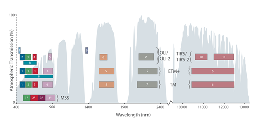

Also, vegetation indices a) NDVI (<a href="https://www.sciencedirect.com/science/article/abs/pii/0034425779900130?via%3Dihub">Normalized Difference Vegetation Index</a>), b) MNDWI (<a href="https://www.tandfonline.com/doi/full/10.1080/01431160600589179">Modified Normalized Difference Water Index</a>), c) NDBI (<a href="https://www.tandfonline.com/doi/abs/10.1080/01431160304987">Normalized Difference Built-up Index</a>) were calculated and added as bands in images to enhance information about vegetation, water and impervious surfaces. They were used together with RGB, NIR, SWIR bands of Landsat images for further processing.

 

<b>Classification of land areas</b>

Land cover classification was performed on the GEE platform using the <a href="https://www.sciencedirect.com/science/article/abs/pii/S0167865505002242">Random Forest</a> classifier, within the framework of the supervised learning application using a series of training data. The RF consists of a set of independently trained decision trees, whose classifications are offset against the final result of the model. Considering the results of all trees, RF produces the final classification image. The training data were defined in the form of points or polygons on the map based on the actual knowledge of the areas of Athens based on personal ground contact. The training data and by extension the final classification results were divided into the following categories:
<li>Bare ground</li>
<li>Arable land</li>
<li>Grass</li>
<li>Artificial surfaces (Houses, industries, roads, parking lots, ports, etc.)</li>
<li>Trees/shrubs</li>
<li>Water</li>

 

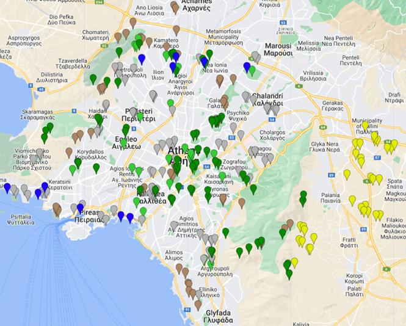

The B2-B7 (RGB, NIR, SWIR) bands of Landsat images, along with NDVI, MNDWI and NDBI index bands were utilized in the machine learning algorithm.

To calculate the accuracy of the classification algorithm and the reliability of our result, the confusion matrix should be calculated. In the field of machine learning [confusion matrix](https://www.analyticsvidhya.com/blog/2020/04/confusion-matrix-machine-learning/) - also known as error matrix - is a special table that illustrates the performance of an algorithm (supervised learning). Each column of the table represents the cases in a predicted class while each row represents the cases in an actual class (or vice versa). Its name is derived from the fact that it makes it easy for us to observe if the system confuses one category with another.

From the confusion table we can calculate the accuracy based on the formula:
$accuracy={(TP+TN)\over(TP+TN+FP+FN)}$, where TP = true positive, TN = true negative, FP = false positive, FN = false negative. Simply put, accuracy captures "the percentage of correct estimates."
Kappa is another index that helps evaluate the performance between a set of classifiers. Kappa is designed to compare the performance of any classifier to the baseline of a "random classifier". In particular, $κ={(accuracy-random accuracy)\over(1-random accuracy)}$

 

<b>Defining city limits - study area</b>

Single class intensity maps were created for built up areas and green areas (grass/shrubs/trees).
Based on the builtUp intensity map, a mask was created that defines the boundaries of the study area, keeping the image pixels whose "neighborhood" had more than 20% percentage of artificial areas. The reduceNeighborhood and updateMask methods of GEE came in handy for this purpose. This is how the boundaries of the city were drawn and along with some simplifications, where the areas of Aspropyrgos, Elefsina, Agios Stefanos and Eastern Attica were excluded, we ended up with a compact outline.

 

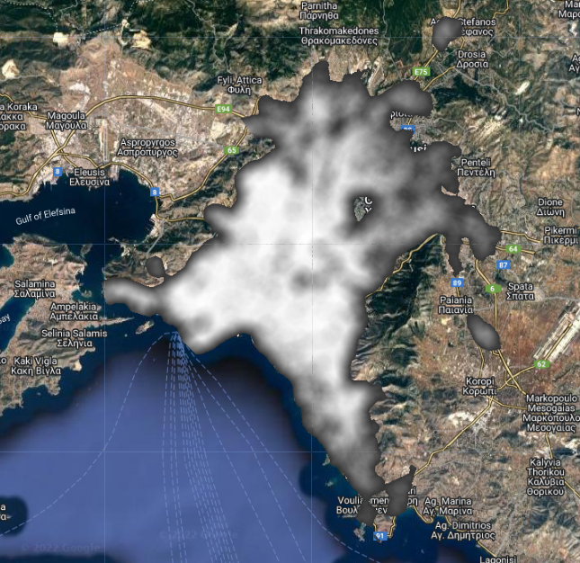

In a similar way we calculated the mask for the areas that have nearby urban green spaces of 1 hectare (10000 square meters) and more, i.e. a minimum of 11 pixels (30mx30m=$900m^2$, 10000/900=11.1) of green space per 300 meter radius. Single intensity maps of greenery were used, where trees, bushes and grass have a value of 1.

 

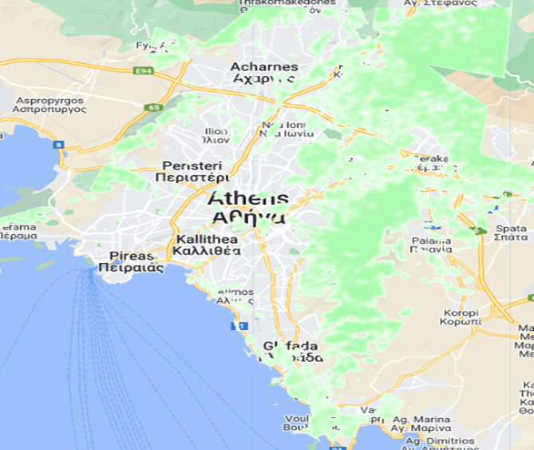

 

<b>Availability and accessibility of urban green spaces</b>

We calculate the availability of urban green spaces based on the formula PUGS=UGS/BUA x 100%, derived from the percentage of urban green spaces to the total study area within the city limits.
We calculate accessibility based on the formula AI=Νacc/Ntotal x 100%, which results from the population located at a distance of up to 300m from an urban green space of 1 hectare or more, to the total population of the area. The green mask was applied to the spatial population distribution.
The spatial distribution of the population is provided by the <a href="https://www.worldpop.org/">World Pop</a> project with the image collection “WorldPop Global Project Population Data: Estimated Residential Population per 100x100m Grid Square”. Briefly, in this project recent census-based population counts are analyzed into ~100x100m grid cells through machine learning approaches.

 

<b>Results</b>

Regarding the results of the land coverage classification, it is observed that there is a relative stability between the years 2013-2022, with a decrease of 1.4% of artificial areas, 0.9% of intense vegetation and an increase of 4.2% of low vegetation/grass. Especially if we take into account that for the year 2022 the city boundaries used were larger due to the expansion of building, the results are not particularly encouraging. Also the fact that lower vegetation forms seem to prevail over trees does not provide the same benefits that we would otherwise obtain. The availability of urban green spaces fluctuates in low percentages and is concentrated in areas mainly in the north and east of Athens.

The accuracy of the machine learning mechanism ranges as follows:
<li> 2013: accuracy = 95.77%, kappa=94.55%</li>
<li> 2018: accuracy = 97.58%, kappa=96.89%</li>
<li> 2022: accuracy = 96.07%, kappa=94.94%</li>

 

<b>Summary of landcover class areas 2013</b>
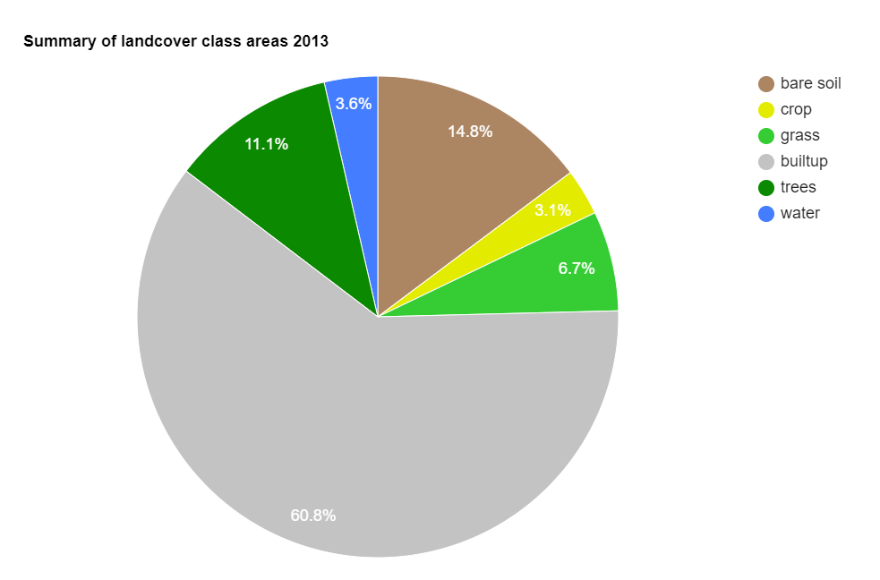
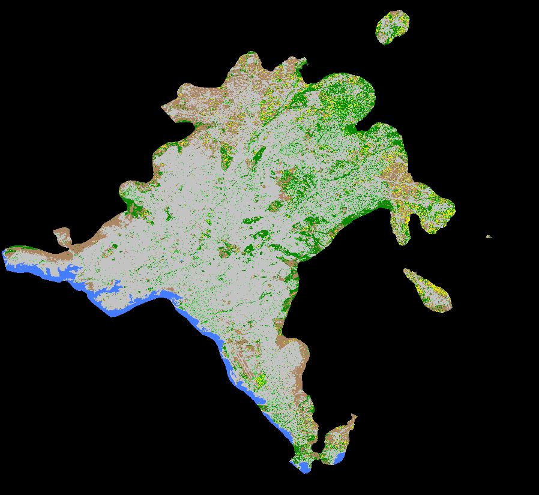

 

<b>Summary of landcover class areas 2018</b>
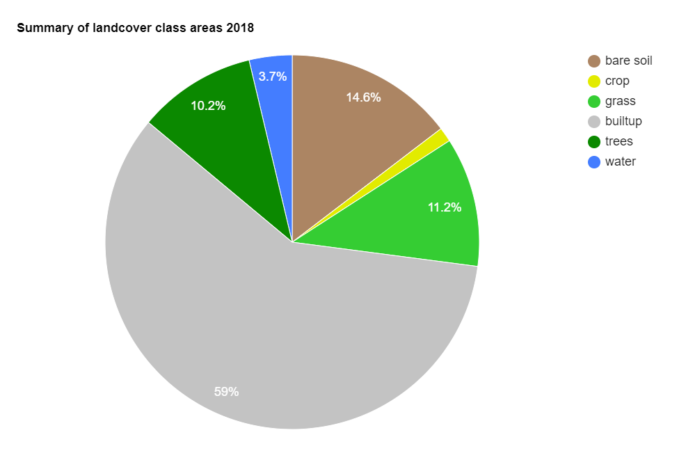
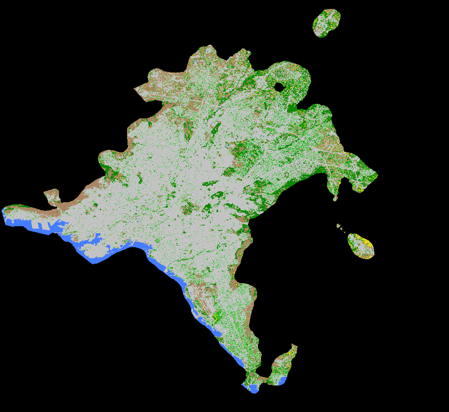

 

<b>Summary of landcover class areas 2022</b>
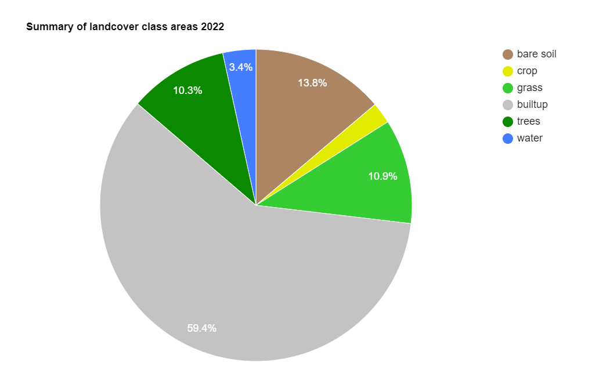
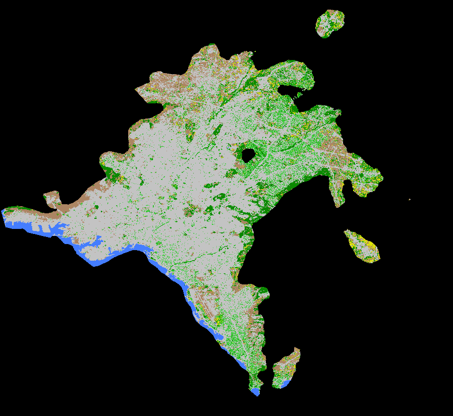

 

Regarding the index of accessibility to green spaces, it increased over the years by 7 percentage points, but there is a huge room for improvement. The following numbers were observed:

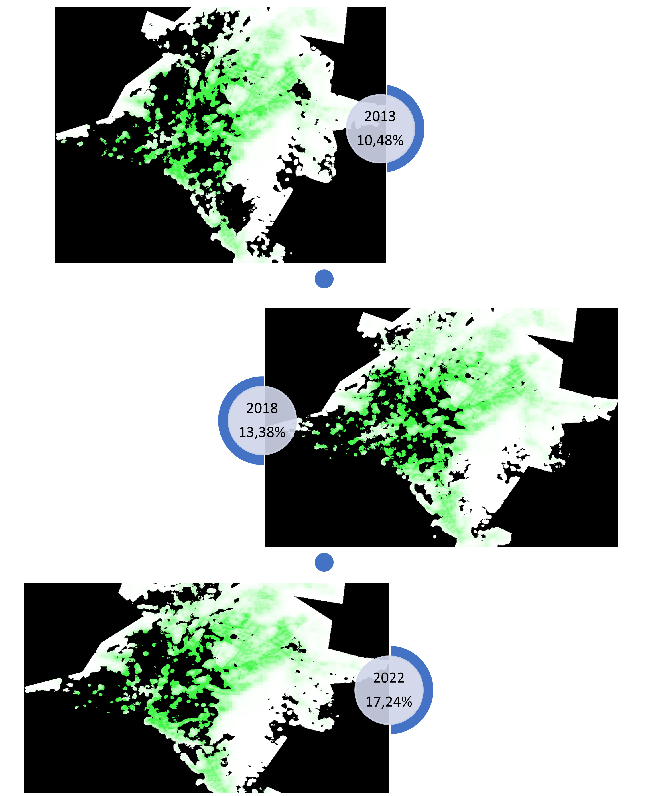

Although most of Athens geographically is relatively close to green spaces, this is not the case in the areas of the center, west and southwest of the center, which are the areas with the highest population density. A breath of fresh air for these areas are the few large parks such as the Tritsi park, the Veikou grove, the Peristeri grove and the green spaces in Lykavitto, Pnyka, Zappeio that have been marked in the image.

It is clear that no significant progress has been recorded in Athens around the issue of urban green spaces. Many squares even today are being "redeveloped" having cement as their main element, or at best having a low-level grass section. The metropolitan parks of Athens are few and most citizens only have access to smaller parks and squares.

Apart from the clear impact that greenery has on reducing temperature and increasing air quality, there are also many collateral "losses". Greater energy consumption and costs due to the temperature, respiratory problems, less exercise potential, reduced social cohesion and  psychological tension.

In any case, emphasis should be placed on the most affected areas of the center and the western-south-western suburbs to reverse this alarming situation of an unsustainable city.

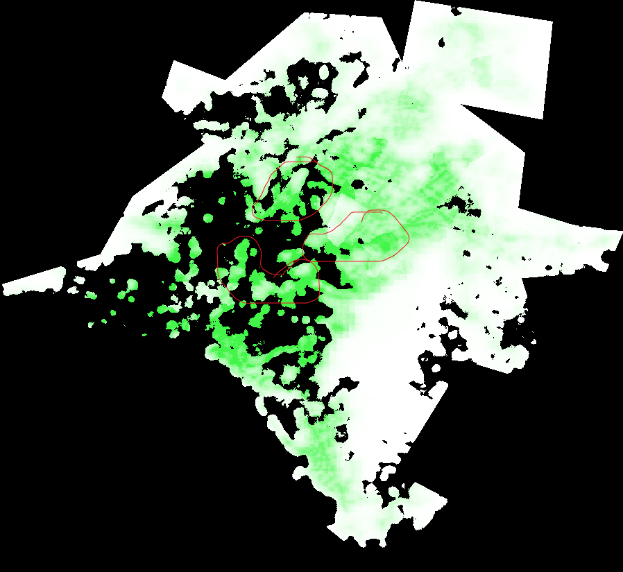

